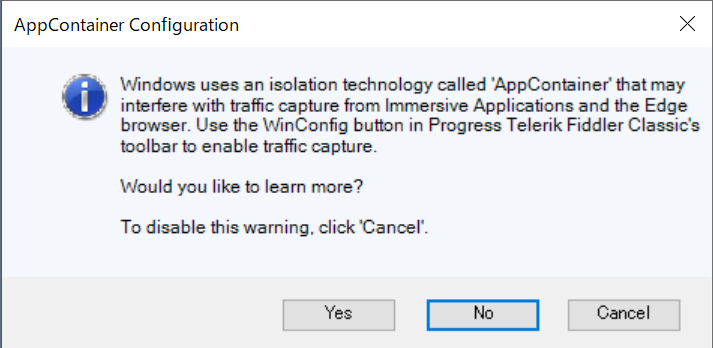
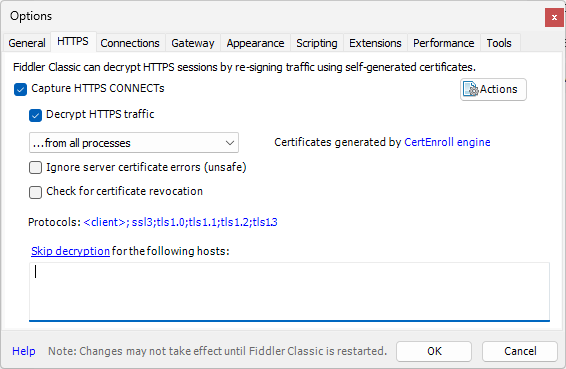
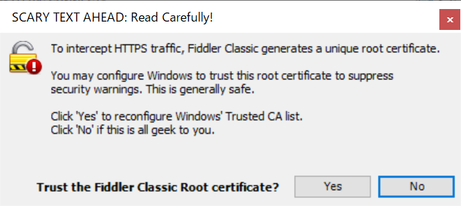
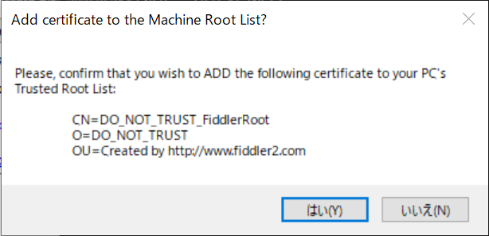
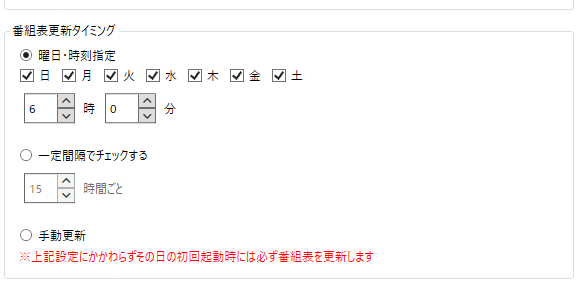
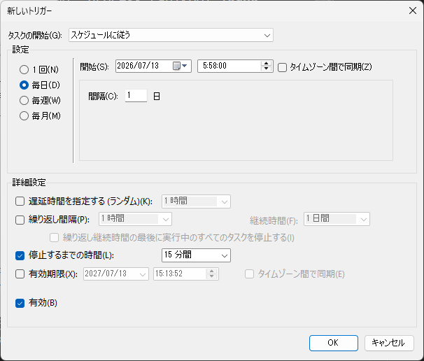
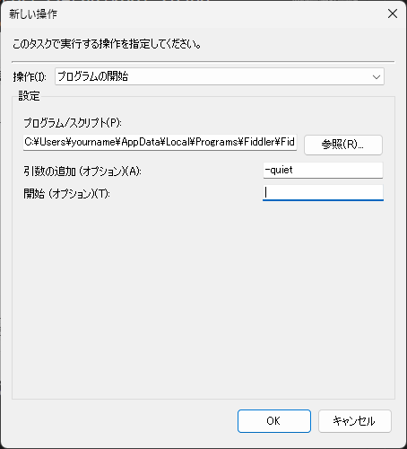

# Radikoolがラジコの番組表を取得するときに発生する問題へのワークアラウンド

現在、Radikoolがラジコの番組表を取得するとき、途中で止まってしまう問題がある。
ここでは、これへの対策としてFiddlerを使って番組表取得を正常終了させる方法を示す。
以下、番組表とはラジコの番組表のことを意味するものとする。

## 原因

Radikoolが番組表のURLにアクセスしたときのレスポンスとして、
```
Content-Encoding: gzip
```
が不規則に返されることがあり、これを解凍できずに処理が止まってしまう。
すべての番組表が平文で返ってくることもあり、何回も試していると成功することがあるのはこのためである。

## 対応方法

通信解析ツールFiddler Classicを使って、圧縮された番組表を受信した場合、Fiddlerに解凍を実行させRadikoolに渡し、Radikoolが番組表を解析できるようにする。

### Fiddlerとは

Fiddler（Fiddler Classic）は、PCとインターネットの間で行われるHTTP/HTTPS通信をキャッチし、内容の確認やデータの変更（プロキシ処理）ができるネットワークデバッグツールである。

### 本プロジェクトにおける役割

通常、開発が終了した古いアプリケーションは、最新の通信仕様や圧縮方式（gzipなど）に対応できず通信エラーを起こす。本プロジェクトでは、Fiddlerを「仲介役（プロキシ）」として間に挟むことで、以下の処理を自動化している。

* Radikoolの代わりに、サーバーから圧縮データ（gzip）を含む番組表を受信する。
* Fiddlerの内部スクリプト（FiddlerScript）を用いて、データを自動的に解凍する。
* Radikoolが解釈できるプレーンなデータ（平文）に変換してから、アプリへと転送する。

これにより、Radikool本体のプログラム（バイナリ）を一切改造することなく、通信のレイヤーだけで番組表の取得を安全に延命・復活させている。

## 手順

### Fiddler Classicのインストール

以下のURLからFiddler Classicをダウンロードし、Radikoolを実行しているPCにインストールする。非商用目的であれば無料で利用できる。

https://www.telerik.com/fiddler

### Fiddler Classicの設定

#### AppContainer Configuration

初回起動時に、以下のダイアログが出る。


Cancelを選択する。

#### HTTPSの復号を有効にする

Fiddlerがgzipされた番組表を解凍できるように、HTTPS通信の復号を有効にする。
メニューの"Tools" → "Options"で、"HTTPS"のタブを開く。
"Decrypt HTTPS trafic"をチェックする。



"SCARY TEXT AHEAD: Read Carefully!"のダイアログは、
Yesを選択する。Yesにしないと復号できないため。以下、同じ。



セキュリティの警告が出るが、"はい"を選択する。

"Add certificate to the Machine Root List?"のダイアログは"はい"にする。


インストールした証明書は、certmgr.mscアプリから確認できる。
また、HTTPSタブ内にある、"Actions"ボタンから、"Reset All Certificates"を選択すると削除できる。

### Fiddler Scriptにコードを追加する

Windowsで動作している他のアプリの通信に影響を与えないようにするため、Fiddler Scriptにコードを追加して、Radikoolの番組表取得の通信だけに介在するように手を加える。
アプリの上の方に並んでいるボタンの中から、"FiddlerScript"を押す。Scriptが表示される。
OnBeforeResponse関数に移動する。"Go to"の中から選んでもよい。
以下のコードの"ここから"、"ここまで"のコードをOnBeforeResponseにコピペする。

```
    static function OnBeforeResponse(oSession: Session) {
        if (m_Hide304s && oSession.responseCode == 304) {
            oSession["ui-hide"] = "true";
        }
        // ここから
        // 念のためradikoolがradiko番組表にアクセスする通信に限定する
        // ex. https://radiko.jp/v3/program/station/weekly/INT.xml
        if (oSession.HostnameIs("radiko.jp") &&
            oSession.LocalProcess != null && oSession.LocalProcess.Contains("radikool") &&
            oSession.PathAndQuery.ToLower().Contains("program")
        ) {
            oSession["ui-color"] = "blue";
            var fullPath = oSession.PathAndQuery;
            var lastName = System.IO.Path.GetFileName(fullPath);
            // クエリパラメータ（?以降）が付いている場合に、純粋なファイル名だけにするための対策
            if (lastName.Contains("?")) {
                lastName = lastName.Split('?')[0];
            }
            FiddlerApplication.Log.LogString("★[Radikool延命] 番組表取得 " + lastName + ", process=" + oSession.LocalProcess);
            // 1. まず Content-Encoding ヘッダーが存在するかチェック
            if (oSession.oResponse.headers.Exists("Content-Encoding")) {
                // 2. ヘッダーの値を取得し、小文字にして「gzip」が含まれるか判定
                var encodingValue = oSession.oResponse.headers["Content-Encoding"].ToLower();
                if (encodingValue.Contains("gzip")) {
                    FiddlerApplication.Log.LogString("★[Radikool延命] gzip encoded timetable");
                    oSession["ui-bold"] = "true";
                    // 【重要】これら2行をセットで呼び出すことで、安全にバッファを確保してフリーズを防ぎます
                    oSession.utilFindInResponse("◆", false); // ダミーの検索を走らせてボディの読み込みを完了させる
                    var bResult = oSession.utilDecodeResponse(); // 安全に解凍を実行
	            
                    // 正常に解凍できたら緑の太字にする
                    if (bResult) {
                        FiddlerApplication.Log.LogString("★[Radikool延命] gzip圧縮されたレスポンスを自動解凍しました。URL: " + oSession.url);
                        oSession["ui-color"] = "green";
                        oSession["ui-bold"] = "true";
                    } else {
                        // 解凍に失敗した場合は赤の太字（デバッグ用）
                        oSession["ui-color"] = "red";
                        oSession["ui-bold"] = "true";
                    }
                }
            }
        }
        // ここまで
    }
```

"Save Script"ボタンを押して保存する。

## 動作確認

ここまでで準備ができたので、Fiddlerを起動した状態で、Radikoolで番組表取得を行う。
Radikoolの"ツール" → "番組表手動更新"からラジコの局を選んで番組表を取得する。
番組取得の進捗(X/Nのように表示される)が消えていれば成功した。また、Fiddlerのログタブにメッセージが出力されている。以下はLFR、FMJ、BAYFMの番組表が圧縮されていたが、Fiddlerが解凍した例である。

```
14:57:43:0592 ★[Radikool延命] 番組表取得 TBS.xml, process=radikool:28968
14:57:43:3620 ★[Radikool延命] 番組表取得 QRR.xml, process=radikool:28968
14:57:43:5230 ★[Radikool延命] 番組表取得 LFR.xml, process=radikool:28968
14:57:43:5230 ★[Radikool延命] gzip encoded timetable
14:57:43:5389 ★[Radikool延命] gzip圧縮されたレスポンスを自動解凍しました。URL: radiko.jp/v3/program/station/weekly/LFR.xml
14:57:43:8582 ★[Radikool延命] 番組表取得 INT.xml, process=radikool:28968
14:57:44:1921 ★[Radikool延命] 番組表取得 FMT.xml, process=radikool:28968
14:57:44:3192 ★[Radikool延命] 番組表取得 FMJ.xml, process=radikool:28968
14:57:44:3192 ★[Radikool延命] gzip encoded timetable
14:57:44:3352 ★[Radikool延命] gzip圧縮されたレスポンスを自動解凍しました。URL: radiko.jp/v3/program/station/weekly/FMJ.xml
14:57:44:5573 ★[Radikool延命] 番組表取得 JORF.xml, process=radikool:28968
14:57:44:6699 ★[Radikool延命] 番組表取得 BAYFM78.xml, process=radikool:28968
14:57:44:6699 ★[Radikool延命] gzip encoded timetable
14:57:44:6861 ★[Radikool延命] gzip圧縮されたレスポンスを自動解凍しました。URL: radiko.jp/v3/program/station/weekly/BAYFM78.xml
14:57:45:0407 ★[Radikool延命] 番組表取得 NACK5.xml, process=radikool:28968
14:57:45:2279 ★[Radikool延命] 番組表取得 YFM.xml, process=radikool:28968
14:57:45:3847 ★[Radikool延命] 番組表取得 IBS.xml, process=radikool:28968
14:57:45:6851 ★[Radikool延命] 番組表取得 JOAK.xml, process=radikool:28968
14:57:45:8787 ★[Radikool延命] 番組表取得 RN1.xml, process=radikool:28968
14:57:45:9911 ★[Radikool延命] 番組表取得 RN2.xml, process=radikool:28968
14:57:46:2783 ★[Radikool延命] 番組表取得 JOAK-FM.xml, process=radikool:28968
```

## Radikoolが番組表を取得するタイミングでFiddlerを起動する(任意)

常時Fiddlerを起動しておく必要はないので、Radikoolが番組表を取得する時間帯のみFiddlerを起動することにする。ただし、以下のように決まった時刻に番組表を取得する設定にしているときに限る。



Windowsのタスクスケジューラを使用して、Radikoolが番組表を更新する時刻の前にFiddlerを起動して、終了していそうな頃に終了させる。

タスクスケジューラで新規タスクを作成する。トリガータブで、例えば以下のようなスケジュールを設定する。



午前6時に番組表を更新する設定なら、5:58頃にFiddlerを起動する。取得後はFiddlerを終了させたいので、「停止するまでの時間」を指定しておけばその時間になるとFiddlerを終了させることができる。

操作のタブでFiddlerの開始を指定する。



Fiddlerは、default設定でインストールしたなら、以下のパスにある。

"C:\Users\yourname\AppData\Local\Programs\Fiddler\Fiddler.exe"

yourname部分を自分のアカウントに置き換える。
「引数の追加」に"-quiet"を指定しておくと最小化の状態で起動される。

なお、その日の初回起動時には、設定にかかわらず番組表を取得する仕様になっているので、この場合は事前にFiddlerを起動しておく必要がある。
